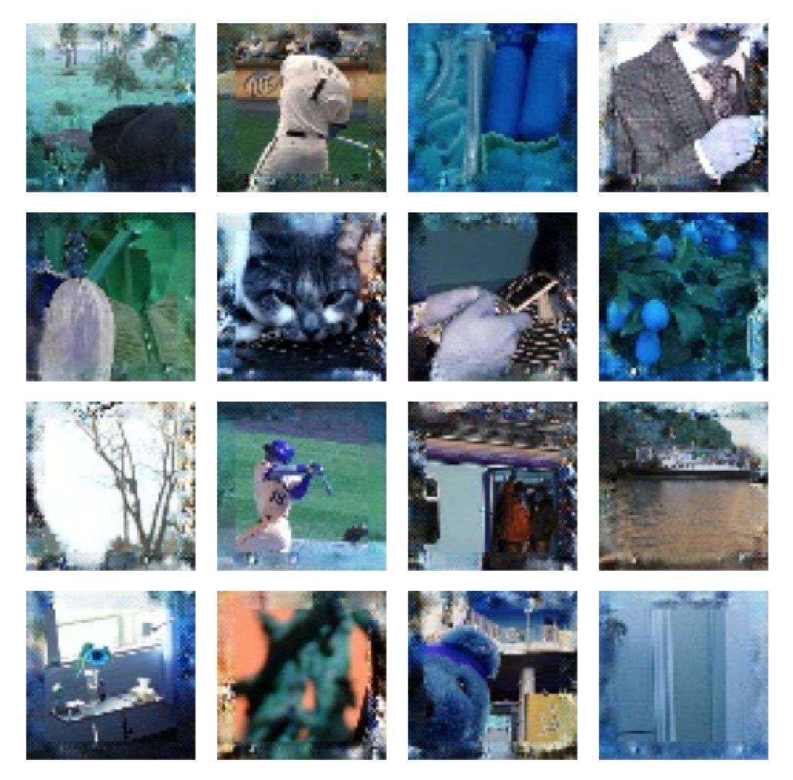
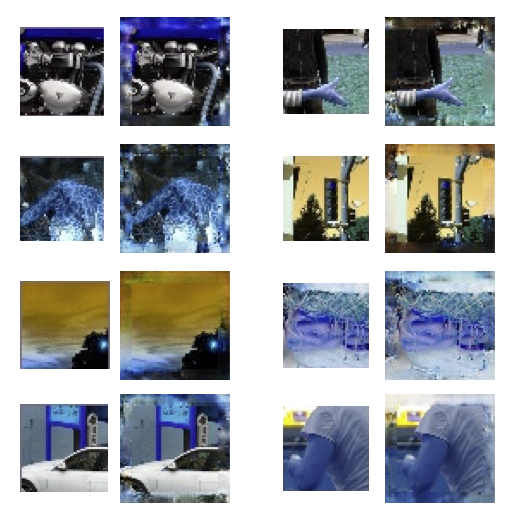

# Project 3: Outpainting
 CS 523: Multimedia Systems - Generative models for creative intelligence
 
 Spring 2017
 
 http://creativecoding.evl.uic.edu/courses/cs523/

* This work is further extension of "Context Encoders: Feature Learning by Inpainting" by [Pathak et. al](http://www.cs.berkeley.edu/~pathak/papers/cvpr16.pdf). 
* We will be starting with the Tensorflow implementation by [T. Kim](https://github.com/jazzsaxmafia/Inpainting). 

### Outpainting Results

Outpainting Results obtained after training 2000 epochs. 

Video Link: https://youtu.be/EvQ1Adle_iE

Demo Link: http://sage2rtt.evl.uic.edu:8181/

### Compare Test results with inputs 

Test results obtained where the left image is the input image and the right image is the Outpainted image in each pair.

### Write-up Link 

* [Formal technical report of the project](http://joysword.com/docs/cs523/final_writeup-Shi-Shiwangi.pdf)

### Paper Summaries 
* [Summary](https://docs.google.com/document/d/1_Mgj8AkLhQoViIsmhQylNKxNK9b3OeZDRMaLNRsCP3w/edit?usp=sharing) of the original Context Encoders paper. 
